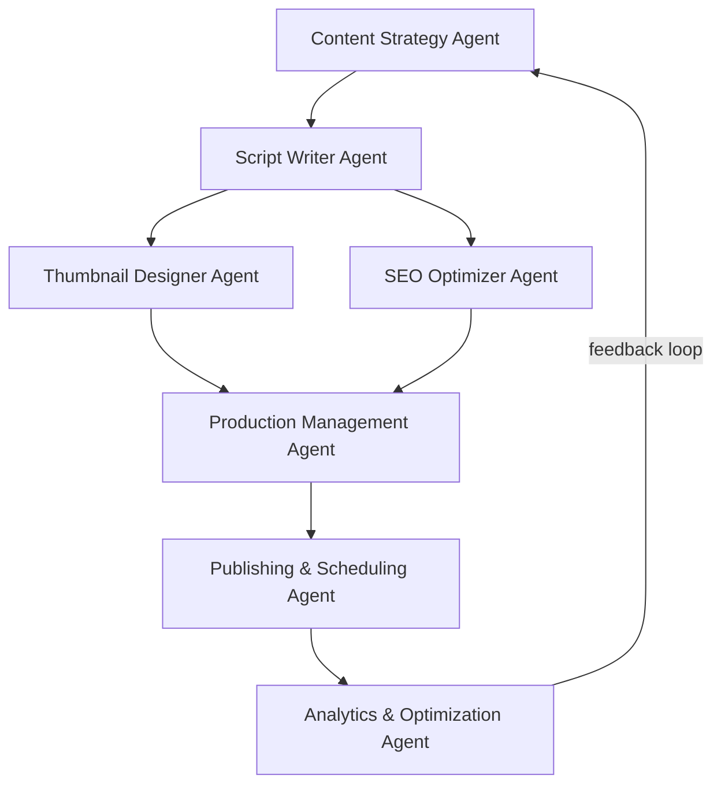
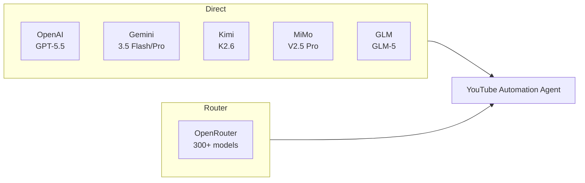
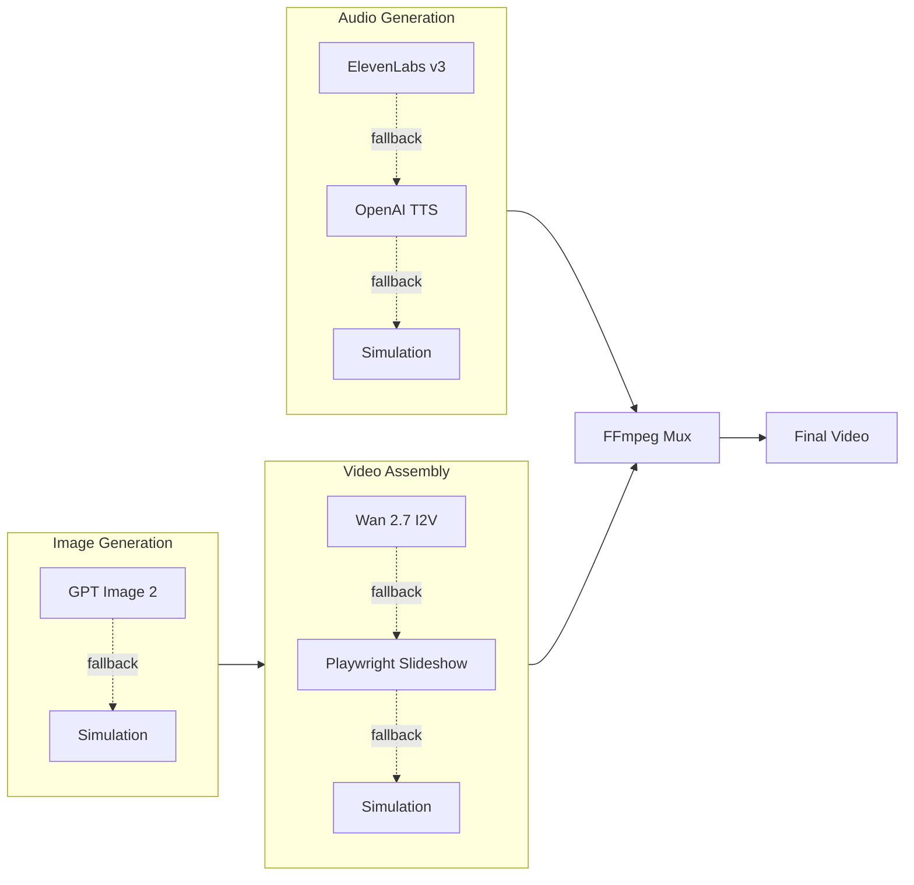

# YouTube Automation Agent

## What's New in v2.1

- **Real AI generation wired in** — the Content Strategy, Script Writer, and SEO agents now call your configured AI provider (OpenAI, OpenRouter, Kimi, MiMo, GLM, or Gemini) for topics, scripts, titles, descriptions, and tags. If no provider key is set, they fall back to the built-in templates so the pipeline still runs.
- **API protection** — set `API_KEY` in `.env` and the mutating endpoints (`POST /generate`, `POST /publish/:id`) require a matching `x-api-key` header. Request bodies are validated and size-limited.
- **Safer publishing** — default privacy is now `private` (set `DEFAULT_PRIVACY_STATUS=public` to opt in), and the uploader streams the real video file — it refuses to upload placeholder assets from simulated runs.
- **Startup and scheduler fixes** — added the missing `sharp` dependency (the app previously crashed on boot), created the missing `automation_events` table (every scheduled task previously threw on logging), fixed the double-insert in the content pipeline, and fixed the publish-queue removal.
- **No more fabricated statistics** — template scripts no longer invent numbers like "90% of people…".
- **Cleaner repo** — removed two dead OAuth flows (`authenticate.js`, `simple-auth.js` used Google's long-deprecated OOB flow), dead dependencies (`cron`, `jimp`), broken npm scripts, and committed build artifacts. Added ESLint (`npm run lint`) and GitHub Actions CI.

## What's New in v2.0

- **Model upgrades across the board** — GPT-5.5 / GPT-5.5 Instant replace GPT-4-turbo, GPT Image 2 replaces DALL-E 3, Gemini 3.5 Flash/Pro replace Gemini 1.x, ElevenLabs Eleven v3 replaces v1, Wan 2.7 replaces Stable Video Diffusion
- **OpenAI SDK v6** — upgraded from v4, along with `@google/genai` v2.9, `replicate` v1.4, `googleapis` v173
- **Revamped setup wizard** — new TTS service picker (OpenAI TTS / ElevenLabs / Azure), ElevenLabs credential setup, updated model selection menus
- **Fixed deprecated API patterns** — OpenAI v3 SDK calls in credential testing replaced with v4+ patterns
- **Dynamic year in content strategy** — no more hardcoded "2025" in trend analysis prompts
- **README rewrite** — developer-focused docs with Mermaid architecture diagrams, no fluff

---

Fully automated YouTube channel management system. AI agents handle content strategy, scriptwriting, thumbnail generation, SEO, publishing, and analytics — end to end, on a daily schedule.

## Built by

[@darkzOGx](https://github.com/darkzOGx). Solo builder shipping AI automation and developer tools. Currently building ConstructionBids.ai.

Find me on [X](https://x.com/darkzOGx) and [laderalabs.io](https://laderalabs.io).

If this saves you time, a star helps it reach more developers.

## Architecture



## How It Works

Each agent handles one stage of the pipeline:

| Agent | Role |
|-------|------|
| **Content Strategy** | Analyzes YouTube trends, identifies topics, plans content calendar |
| **Script Writer** | Generates scripts with hooks, storytelling, CTAs |
| **Thumbnail Designer** | Creates thumbnails, runs A/B variations |
| **SEO Optimizer** | Keywords, titles, descriptions, tags |
| **Production** | Coordinates TTS audio, image assets, video assembly |
| **Publishing** | Uploads, schedules, manages playlists |
| **Analytics** | Tracks performance, feeds insights back to strategy |

## AI Providers

All OpenAI-compatible providers work out of the box — the system auto-configures the SDK base URL. Pick one, or use OpenRouter to access everything through a single key.



| Provider | Models | Base URL | Cost |
|----------|--------|----------|------|
| **OpenAI** | GPT-5.5, GPT-5.5 Instant | `api.openai.com/v1` | ~$0.05–0.20/video |
| **OpenRouter** | 300+ (GPT, Claude, Gemini, Kimi, GLM, etc.) | `openrouter.ai/api/v1` | varies by model |
| **Google Gemini** | Gemini 3.5 Flash, 3.5 Pro | via `@google/genai` SDK | free tier available |
| **Kimi (Moonshot AI)** | Kimi K2.6, K2.5 | `api.moonshot.ai/v1` | ~80% cheaper than GPT-5.5 |
| **MiMo (Xiaomi)** | MiMo V2.5 Pro, V2.5 | `api.xiaomimimo.com/v1` | competitive |
| **GLM (Zhipu AI)** | GLM-5, GLM-5.1 | `api.z.ai/api/paas/v4/` | ~$1/M input tokens |

Additional integrations: Anthropic Claude (`claude-opus-4-8`), ElevenLabs (Eleven v3 TTS), Replicate (Wan 2.7 video), local models via Ollama, any OpenAI-compatible endpoint.

## Quick Start

```bash
git clone https://github.com/darkzOGx/youtube-automation-agent.git
cd youtube-automation-agent
npm install
cp .env.example .env
cp config/credentials.example.json config/credentials.json
npm run setup   # interactive credential wizard
npm start
```

Dashboard runs at `http://localhost:3456`.

### Prerequisites

- Node.js 18+
- [FFmpeg](https://ffmpeg.org/download.html) on your PATH (used for video assembly and audio muxing)
- Google account (YouTube Data API — free)
- At least one AI provider key (OpenAI or Gemini) — without one, agents fall back to template-based generation

## Configuration

### API Keys

#### YouTube Data API (required, free)

1. Create a project in [Google Cloud Console](https://console.cloud.google.com/)
2. Enable **YouTube Data API v3**
3. Create an OAuth 2.0 client (Desktop app)
4. Save the JSON as `config/credentials.json`

#### OpenAI

1. Get a key from [platform.openai.com](https://platform.openai.com/)
2. Set `OPENAI_API_KEY` in `.env`

#### OpenRouter (easiest — one key, all models)

1. Get a key from [openrouter.ai/keys](https://openrouter.ai/keys)
2. Set `OPENROUTER_API_KEY` in `.env`

#### Google Gemini

1. Get a key from [Google AI Studio](https://aistudio.google.com/)
2. Set `GEMINI_API_KEY` in `.env`

#### Kimi / MiMo / GLM

| Provider | Get key at | Env var |
|----------|-----------|---------|
| Kimi (Moonshot AI) | [platform.kimi.ai](https://platform.kimi.ai) | `MOONSHOT_API_KEY` |
| MiMo (Xiaomi) | [mimo.mi.com](https://mimo.mi.com) | `MIMO_API_KEY` |
| GLM (Zhipu AI) | [z.ai](https://z.ai) | `GLM_API_KEY` |

### Environment Variables

```env
# AI provider — pick one (or use OpenRouter for access to all)
OPENAI_API_KEY=sk-...
# OPENROUTER_API_KEY=sk-or-...
# GEMINI_API_KEY=...
# MOONSHOT_API_KEY=...
# MIMO_API_KEY=...
# GLM_API_KEY=...

# Optional: premium TTS
# ELEVENLABS_API_KEY=...
# ELEVENLABS_VOICE_ID=...

# Optional: AI video generation
# REPLICATE_API_KEY=...

# App config
NODE_ENV=production
PORT=3456
CHANNEL_NAME=Your Channel Name
TARGET_AUDIENCE=Your target audience
YOUTUBE_REGION=US
DEFAULT_PRIVACY_STATUS=private

# Optional: protect mutating API routes (POST /generate, /publish)
# API_KEY=some-long-random-string
```

## Automation Schedule

```mermaid
gantt
    title Daily Pipeline
    dateFormat HH:mm
    axisFormat %H:%M

    section Content
    Generate content (strategy + script + thumbnail + SEO) :06:00, 2h

    section Publishing
    Process publishing queue :crit, 08:00, 14h

    section Analytics
    Collect analytics     :09:00, 1h
    Run optimizations     :22:00, 1h
```



The scheduler runs automatically after `npm start`. Content generation at 06:00, publishing queue processed every 15 minutes, analytics at 09:00, optimization at 22:00. Weekly strategy reviews run on Sundays.

## API

```bash
# health check
curl http://localhost:3456/health

# generate a video on demand (send x-api-key if API_KEY is set in .env)
curl -X POST http://localhost:3456/generate \
  -H "Content-Type: application/json" \
  -H "x-api-key: $API_KEY" \
  -d '{"topic": "Top 10 Life Hacks", "style": "list"}'

# view schedule
curl http://localhost:3456/schedule

# get analytics
curl http://localhost:3456/analytics

# publish a specific content item
curl -X POST http://localhost:3456/publish/:contentId
```

## Production Pipeline



Each stage has graceful fallbacks. If a paid API key isn't configured, the system simulates that step so the rest of the pipeline still runs.

## Extending

### Custom AI provider

```javascript
// utils/ai-service.js
const Anthropic = require('@anthropic-ai/sdk');

class ClaudeAIService {
  constructor(apiKey) {
    this.client = new Anthropic({ apiKey });
  }
  async generateContent(prompt) {
    const message = await this.client.messages.create({
      model: 'claude-opus-4-8',
      max_tokens: 1024,
      messages: [{ role: 'user', content: prompt }]
    });
    return message.content[0].text;
  }
}
```

### Custom content types

```javascript
// agents/content-strategy-agent.js
const contentTypes = {
  'podcast': {
    duration: '10-15 minutes',
    style: 'conversational',
    thumbnail: 'podcast-style'
  },
};
```

## Project Structure

```
youtube-automation-agent/
├── agents/          # one file per agent
├── config/          # credentials, example configs
├── database/        # SQLite schema and access layer
├── data/            # generated content and assets
├── schedules/       # cron-based automation
├── utils/           # AI service wrappers, logging, credential management
├── .github/         # CI workflow (lint + tests on every push/PR)
└── index.js         # Express server + agent initialization
```

## Troubleshooting

| Problem | Fix |
|---------|-----|
| YouTube API quota exceeded | Check quotas in Google Cloud Console; reduce posting frequency |
| Content generation failed | Verify API keys and credits; check `logs/` |
| Publishing failed | Re-authenticate YouTube OAuth tokens; check video format |

Enable debug logging:

```bash
NODE_ENV=development DEBUG_MODE=true npm start
```

## More Tools by darkzOGx

If this was useful, check out:

- [darkzloop](https://github.com/darkzOGx/darkzloop): terminal agent runner that turns any LLM into a disciplined software engineer (FSM control, model-agnostic, BYO auth)
- [darkzBOX](https://github.com/darkzOGx/darkzBOX): open-source Instantly.ai clone with smart automated email replies
- [open-sales-researcher](https://github.com/darkzOGx/open-sales-researcher): autonomous B2B company research. Works with Claude Code, Cursor, Copilot.
- [darkzseo](https://github.com/darkzOGx/darkzseo): SEO tooling

## Contributing

1. Fork the repo
2. Create a feature branch
3. Make changes and add tests
4. Submit a PR

```bash
git clone <your-fork>
cd youtube-automation-agent
npm install
npm run lint   # must pass — CI runs this on every PR
npm test
```

## License

MIT — see [LICENSE](LICENSE).

## Acknowledgments

- [OpenAI](https://openai.com/) — GPT-5.5, GPT Image 2, GPT-4o-mini-tts
- [OpenRouter](https://openrouter.ai/) — unified multi-model API
- [Google](https://ai.google.dev/) — YouTube Data API, Gemini 3.5
- [Moonshot AI](https://www.moonshot.ai/) — Kimi K2.6
- [Xiaomi](https://mimo.mi.com/) — MiMo V2.5
- [Zhipu AI](https://z.ai/) — GLM-5
- [ElevenLabs](https://elevenlabs.io/) — Eleven v3 TTS
- [Replicate](https://replicate.com/) — Wan 2.7 video generation
- [ConstructionBids.ai](https://constructionbids.ai) - AI scans every federal, state & local public works bid and matches you to contracts you'll win.

---

> This tool is for legitimate content creation. Comply with [YouTube's Terms of Service](https://www.youtube.com/t/terms) and Community Guidelines.
